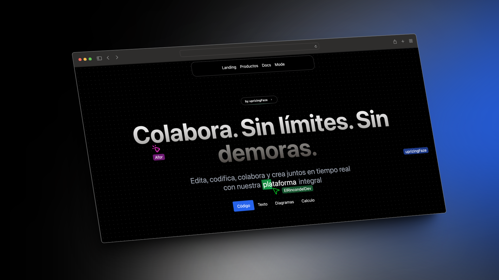

# Colab Tools

Colab Tools es una plataforma integral que permite a los equipos colaborar sin límites ni demoras. Con nuestra suite de herramientas, los equipos pueden editar, codificar, colaborar y crear juntos en tiempo real.

## Características

Colab Tools incluye una serie de editores integrados que permiten a los equipos trabajar juntos de manera eficiente:

- **Editor de Código**: Permite a los equipos escribir y editar código juntos en tiempo real.

- **Editor de Texto**: Proporciona un espacio para la creación y edición colaborativa de documentos de texto.

- **Editor de Diagramas**: Ofrece las herramientas necesarias para crear y editar diagramas en conjunto.

- **Hoja de Cálculo**: Permite a los equipos trabajar juntos en hojas de cálculo, facilitando la colaboración en tareas de análisis de datos y cálculos.

Con Colab Tools, tu equipo siempre estará sincronizado. Potencia la colaboración de tu equipo con nuestra completa suite de herramientas integradas. Desde la creación de documentos hasta el desarrollo de software, nuestro conjunto de editores te proporciona todo lo que necesitas para trabajar en conjunto de manera eficiente y en tiempo real.

# IMPORTANTE

### Mensaje para los jurados

> Si en algún momento dejan de funcionar las apps por favor enviar un correo a uprizingFaze@gmail.com, para cambiar las API's, ya que no tengo muchos créditos 🚨.